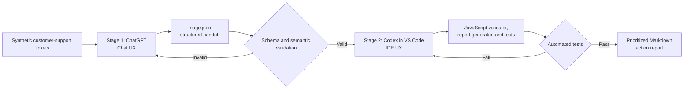

# Workflow diagram

I used the following diagram to show how the output from the Chat UX becomes
the input to the IDE UX.

## Handoff between the UX types

I used `handoff/triage.json` as the cross-tool handoff. Its structure is
defined independently in `schemas/triage.schema.json`.

I treated ChatGPT's classifications as input data in the IDE stage. The
JavaScript code validates, sorts, counts, and formats those decisions without
silently reclassifying them. This separation makes it easier for me to identify
whether a problem came from classification, validation, or report generation.

