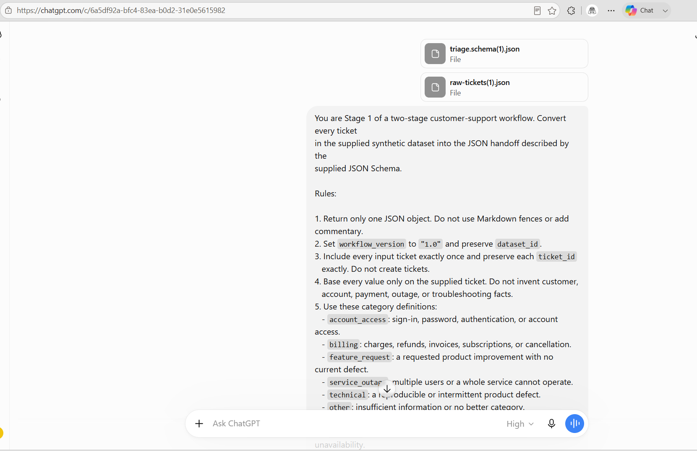
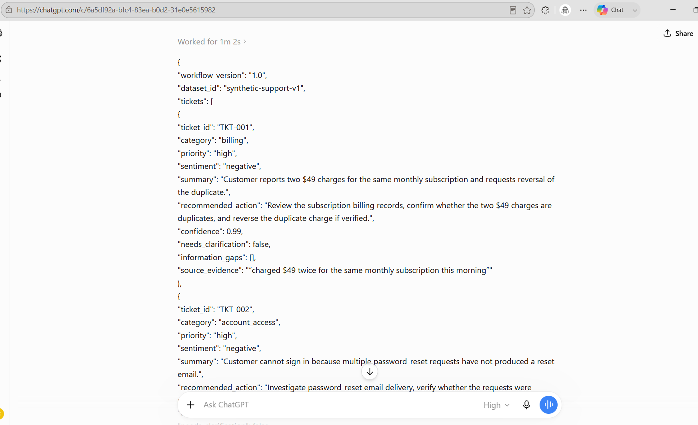
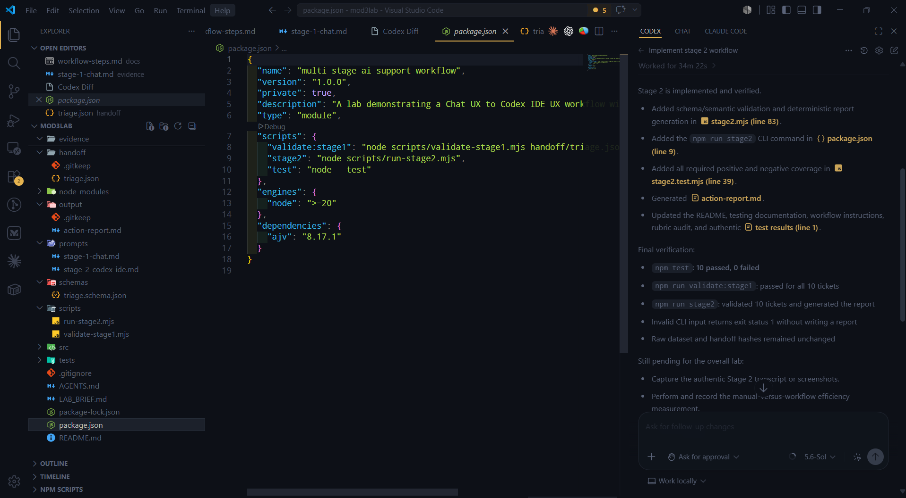
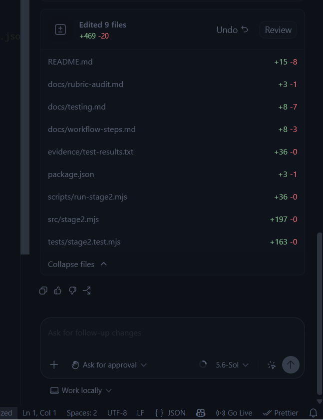
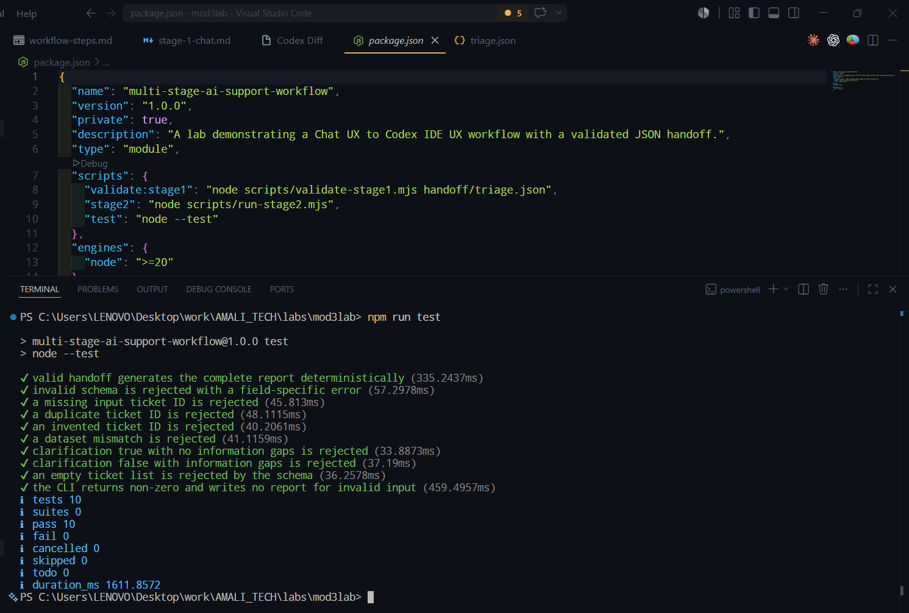
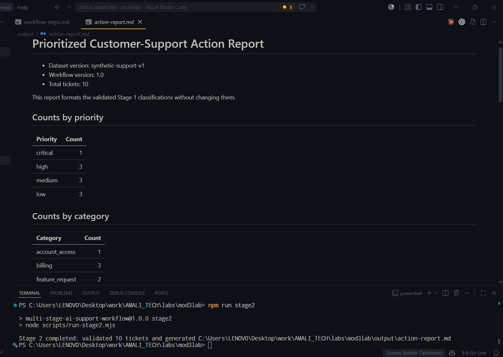

# Screenshot evidence

I captured these screenshots from the actual Chat and IDE UX stages. They are
not generated mockups.

## Stage 1: ChatGPT in Chrome

### Files and prompt

### Structured JSON response

## Stage 2: Codex in Visual Studio Code

### Completion summary

### Change set

### Automated tests

### Successful end-to-end run

